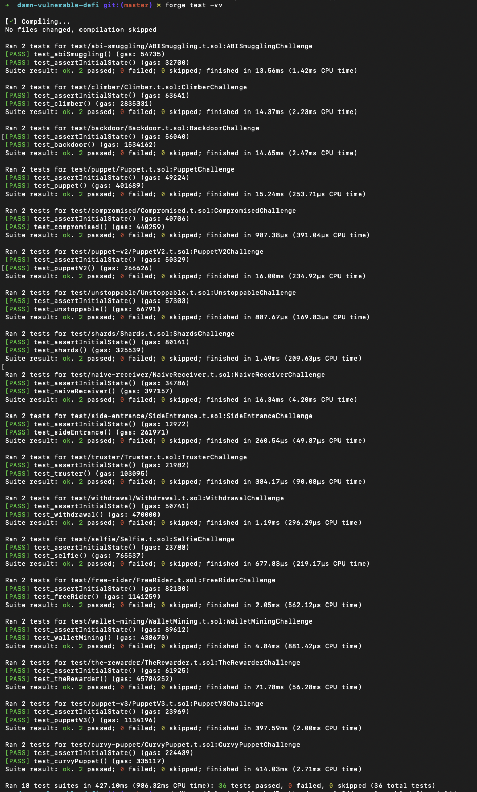

# damn-vulnerable-defi-ariel

**Damn Vulnerable DeFi** est un playground dédié à la sécurité des smart contracts Ethereum.

Ce dépôt contient **mes solutions personnelles** pour la version **v4.1.0**, avec **l’ensemble des tests Foundry validés avec succès**.

---

## 📦 Installation

1. Cloner le dépôt :
   ```bash
   git clone <repo-url>
   cd damn-vulnerable-defi-ariel
   ```

2. Copier le fichier d’environnement :
   ```bash
   cp .env.sample .env
   ```

3. Renseigner un **RPC Ethereum valide** dans `.env`  
   > Requis pour les challenges **PuppetV3** et **CurvyPuppet** (fork mainnet).

---

## 🧪 Lancer les tests

### Lancer tous les tests
```bash
forge test -vv
```

### Lancer un test spécifique (exemple)
```bash
forge test test/withdrawal/Withdrawal.t.sol --match-test test_withdrawal
```

---

## ✅ Résultat des tests



**Commande utilisée :**
```bash
forge test -vv
```

**Résultat :**
- ✅ **36 tests passés**
- ❌ **0 échec**

### Suites validées
- abi-smuggling
- backdoor
- climber
- compromised
- curvy-puppet
- free-rider
- naive-receiver
- puppet
- puppet-v2
- puppet-v3
- selfie
- shards
- side-entrance
- the-rewarder
- truster
- unstoppable
- wallet-mining
- withdrawal

---

## 📝 Notes

- Les challenges utilisant un **fork mainnet** nécessitent impérativement un RPC valide dans le fichier `.env`.
- Tous les tests ont été exécutés et validés **localement** avant rendu.
